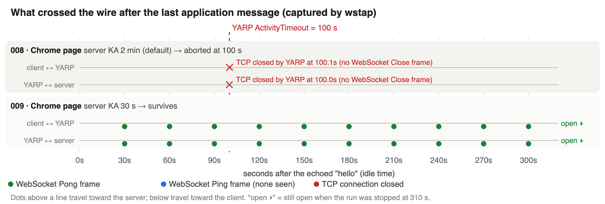

# dotnet/yarp#1764: idle WebSockets are aborted at `ActivityTimeout` unless a keep-alive is shorter than it

**Upstream issue:** [dotnet/yarp#1764](https://github.com/dotnet/yarp/issues/1764) (docs; YARP's docs now live
in [dotnet/AspNetCore.Docs](https://github.com/dotnet/AspNetCore.Docs) under `aspnetcore/fundamentals/servers/yarp/`)
· **Related PR:** not yet · **Status:** evidence captured at real defaults (2026-09-27); issue comment not yet posted

## Claim

A WebSocket proxied through YARP that carries no traffic for `ActivityTimeout` (default **100 s**) is aborted by
the proxy (no WebSocket Close frame; YARP logs `UpgradeActivityTimeout`). Any keep-alive frame from **either end**
(Ping or Pong) resets the timer, so the connection survives if **some endpoint's keep-alive interval is shorter than
`ActivityTimeout`**.

- **Browser clients can't send keep-alives**, so they depend on the destination server. ASP.NET Core's default
  `WebSocketOptions.KeepAliveInterval` (2 min) is longer than 100 s, so **with a browser and server defaults the
  connection is aborted at 100 s**. A 30 s server interval fixes it.
- A .NET `ClientWebSocket` sends its own keep-alive every 30 s by default, so it survives even with server defaults.

## Environment

- .NET SDK 10.0.302 (pinned in [`sample/global.json`](sample/global.json)), `net10.0`
- `Yarp.ReverseProxy` 2.3.0
- .NET runtime 10.0.10; headless Google Chrome 153.0.8010.53 for the browser runs
- macOS 26.3 (arm64), all processes on `localhost`, HTTP/1.1, no TLS
- Evidence runs performed 2026-09-27 (22:28–22:50 UTC)

## Setup

```
IdleClient or    ──►  wstap  ──►  Proxy (YARP)  ──►  wstap  ──►  EchoServer
Chrome page           :5001       :5000              :5051       :5050
sends 1 message,      logs every  ActivityTimeout    logs every  KeepAliveInterval
then goes silent      frame       (appsettings       frame       (WS_KEEPALIVE_SECONDS;
(client keep-alive:               00:01:40)                      default 2 min)
 WS_CLIENT_KEEPALIVE_SECONDS; .NET default 30 s; browsers: none)
```

The two `wstap` relays are optional (`--no-tap`) transparent TCP relays that log each WebSocket frame header and
TCP close with a timestamp. Control run 006 shows they don't change the result.

| Project | What it does |
|---|---|
| [`sample/EchoServer`](sample/EchoServer/Program.cs) | Minimal ASP.NET Core app; echoes WebSocket messages on `/ws`. `KeepAliveInterval` is read from `WS_KEEPALIVE_SECONDS`, default 2 min |
| [`sample/Proxy`](sample/Proxy/Program.cs) | Minimal YARP app routing `/ws` to EchoServer. `ActivityTimeout` set in [`appsettings.json`](sample/Proxy/appsettings.json) to YARP's default of 100 s, overridable by env var |
| [`sample/IdleClient`](sample/IdleClient/Program.cs) | Connects through the proxy, does one echo round trip, then sends nothing and reports when (if ever) the connection dies. `WS_CLIENT_KEEPALIVE_SECONDS` sets its keep-alive (`0` = off), `IDLE_MAX_SECONDS` ends the watch |
| [`sample/tools/`](sample/tools/) | `run-experiment.sh` (one-command runs with headers), `wstap.py` (frame logger), `KeepAliveDefaults/` (prints framework defaults), `browser/` (browser client plus scripted Chrome screenshots), figure generators |

## Reproduce

```bash
cd yarp/1764_websocket_idle_timeout/sample
dotnet build

# Browser-equivalent case: client keep-alive off, server default (2 min) → aborted at ~100 s
tools/run-experiment.sh 004-no-client-ka-server-default-aborts --client-ka 0

# The fix: server keep-alive 30 s → stays open
tools/run-experiment.sh 005-no-client-ka-server-30s-survives --client-ka 0 --server-ka 30
```

Or by hand, in three terminals:

```bash
dotnet run --project EchoServer                                             # add WS_KEEPALIVE_SECONDS=30 for the fix
dotnet run --project Proxy
WS_CLIENT_KEEPALIVE_SECONDS=0 dotnet run --project IdleClient -- ws://localhost:5000/ws
```

Before re-running, confirm the old processes are gone (`lsof -i :5000 -i :5050`). The browser runs and figure
commands are in the [lab report §10](implementations/001-lab-report-idle-websockets-through-yarp.md#10-reproduce).

## Results

All runs use YARP's default `ActivityTimeout` of 100 s except 007. Evidence files are in
[`sample/evidence/`](sample/evidence/).

| # | Client | Client keep-alive | Server `KeepAliveInterval` | Observed | Evidence |
|---|---|---|---|---|---|
| 002 | n/a | | | Defaults on .NET 10.0.10: `ClientWebSocket` 30 s; ASP.NET Core `WebSocketOptions` 2 min | [`002-keepalive-defaults.txt`](sample/evidence/002-keepalive-defaults.txt) |
| 003 | .NET `ClientWebSocket` | 30 s (default) | 2 min (default) | **Open at 310 s**; taps show a client Pong every 30 s | [`003-*`](sample/evidence/panels/003-defaults-dotnet-client-survives.png) |
| 004 | .NET `ClientWebSocket` | off | 2 min (default) | **Aborted at 100.1 s**; proxy `UpgradeActivityTimeout`; no Close frame on either hop | [`004-*`](sample/evidence/panels/004-no-client-ka-server-default-aborts.png) |
| 005 | .NET `ClientWebSocket` | off | 30 s | **Open at 310 s**; a server Pong every 30 s | [`005-*`](sample/evidence/panels/005-no-client-ka-server-30s-survives.png) |
| 006 | as 004, no taps | off | 2 min (default) | Aborted at 100.1 s (control) | [`006-*`](sample/evidence/panels/006-no-client-ka-server-default-aborts-no-tap.png) |
| 007 | .NET, `ActivityTimeout` 8 s | 30 s (default) | 2 min (default) | Aborted at 8.0 s | [`007-*`](sample/evidence/panels/007-8s-override-dotnet-client-default-aborts.png) |
| 008 | Chrome page | none possible | 2 min (default) | **Aborted at 100.1 s**, close code 1006, `wasClean=false`; Chrome sent no frames while idle | [screenshot](sample/evidence/screenshots/008-browser-server-default-aborts-closed.png) |
| 009 | Chrome page | none possible | 30 s | **Open at 310 s** | [screenshot](sample/evidence/screenshots/009-browser-server-30s-survives-still-open-t310s.png) |



Full write-up, with figures, screenshots and limitations:
[`implementations/001-lab-report-idle-websockets-through-yarp.md`](implementations/001-lab-report-idle-websockets-through-yarp.md).

## Notes

- Not verified: TLS, WebSockets over HTTP/2, browsers other than Chrome, .NET/YARP versions other than those above,
  and anything beyond loopback (real load balancers and NAT add their own idle timers).
- `001-first-attempt-*` is an earlier all-defaults run with the .NET client. It stayed open, for the same reason as 003.
- In the surviving .NET runs, the client's final line reads `Final client state: Aborted`. That's caused by the
  harness stopping the watch (cancelling `ReceiveAsync` aborts a `ClientWebSocket`), not by the proxy.

## Why it happens (short version)

YARP doesn't parse WebSocket frames after the upgrade. It copies bytes in both directions (`StreamCopier`) and
resets an activity watchdog whenever any byte moves. Ping/Pong control frames from either end are bytes too, so
they reset the watchdog even though neither application sees them. If nothing moves for `ActivityTimeout`, YARP tears down
both connections without a close handshake. Longer write-up:
[`lectures/001-yarp-websocket-activity-timeout.md`](../../lectures/001-yarp-websocket-activity-timeout.md).
