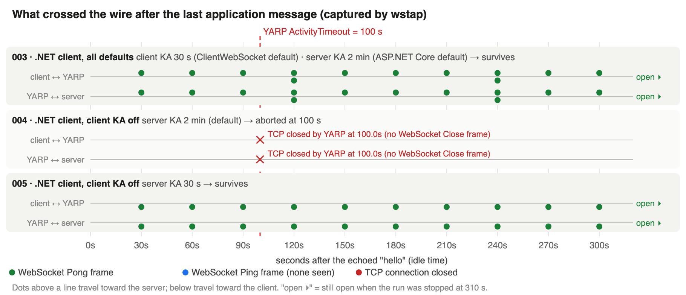
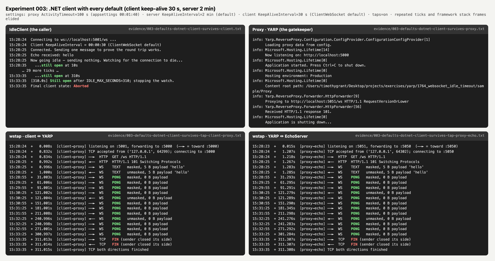
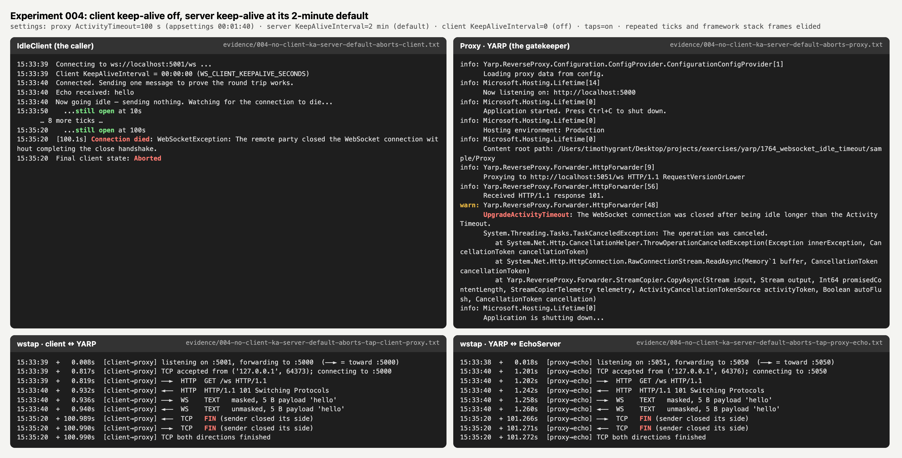
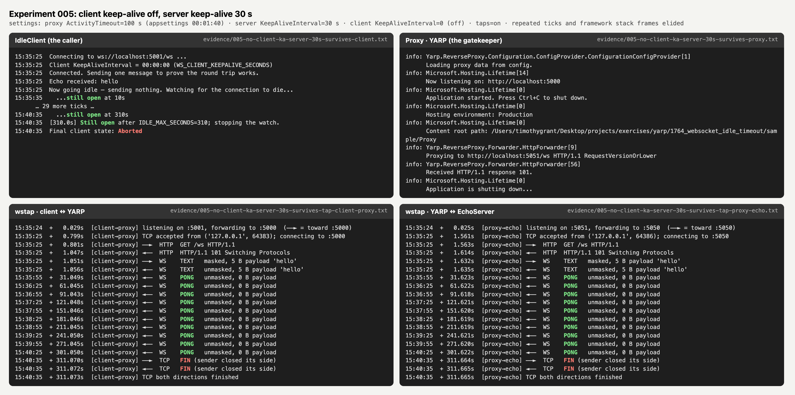
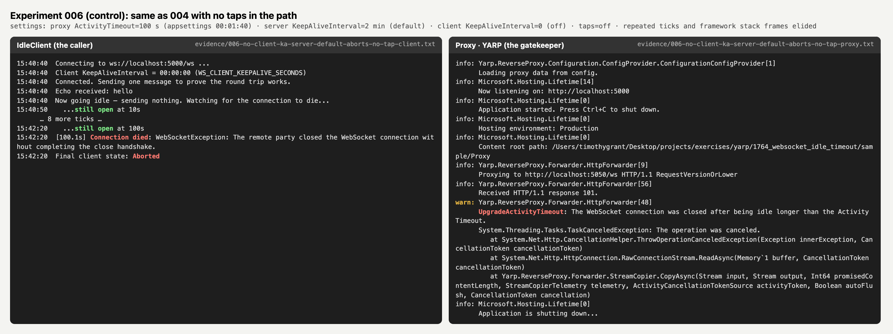
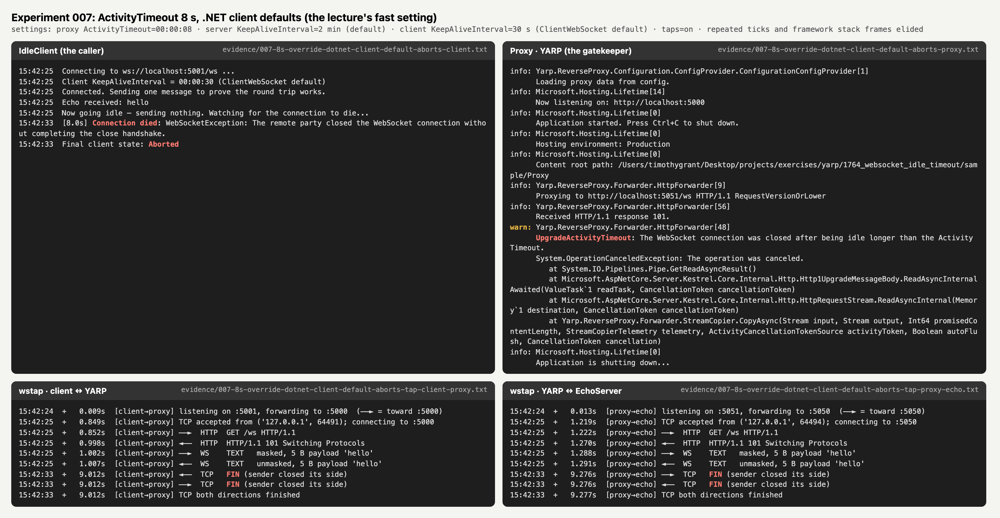
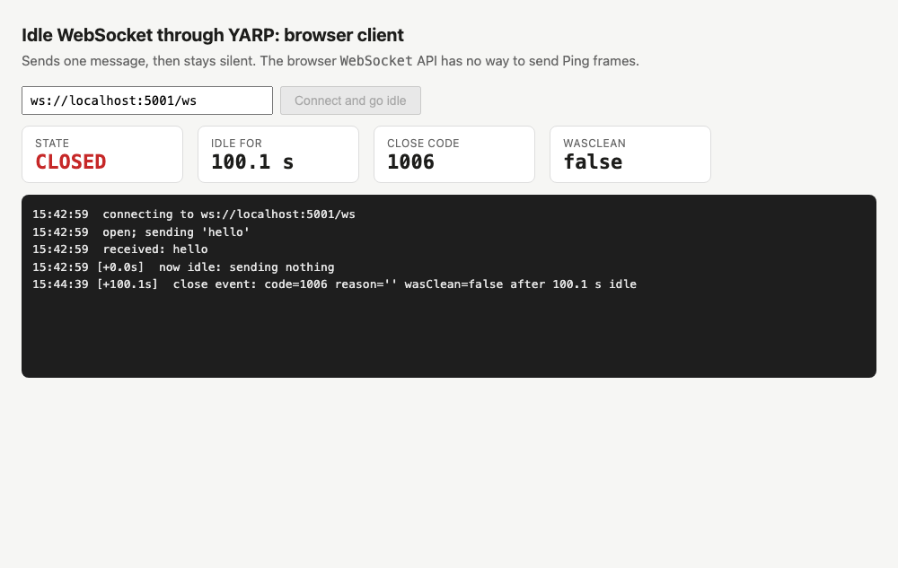
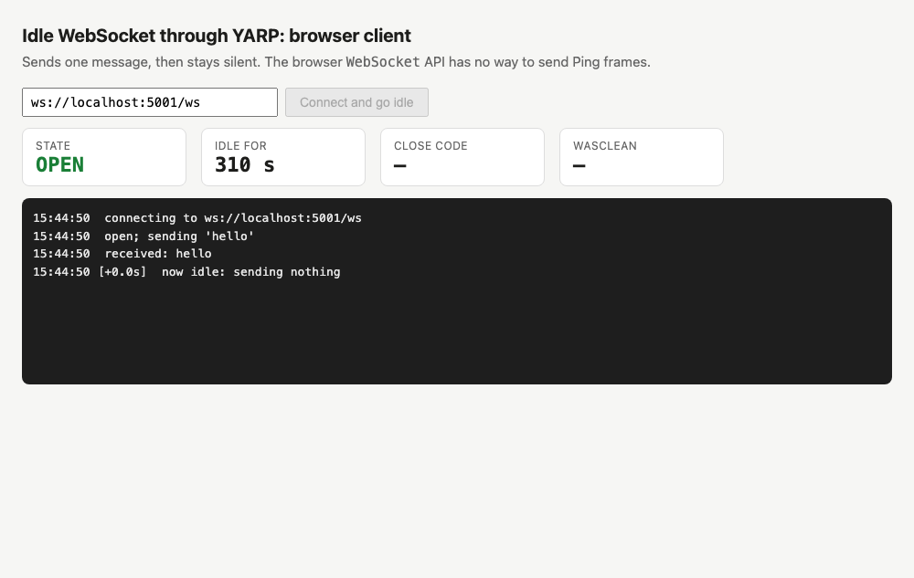

# Lab Report 001: Idle WebSockets through YARP, and who keeps them alive

> **Date of runs:** 2026-09-27, 22:28–22:50 UTC (15:28–15:50 local)
> **Related issue:** [dotnet/yarp#1764](https://github.com/dotnet/yarp/issues/1764) (re-checked 2026-09-27: open, unassigned,
> Backlog, no activity since 2023-01-09)
> **What this file is:** the complete, self-contained write-up of the evidence session. Every number below comes from a file
> in [`../sample/evidence/`](../sample/evidence/); the index is in §11.
> **Environment:** macOS 26.3 (arm64) · .NET SDK 10.0.302 / runtime 10.0.10 · `Yarp.ReverseProxy` 2.3.0 · headless Google
> Chrome 153.0.8010.53 · Python 3.14.0 · Node 26.3.0 · all processes on `localhost`, HTTP/1.1, no TLS

---

## 0. Result on one screen

| # | Client | Client keep-alive | Server keep-alive | Proxy `ActivityTimeout` | Outcome | Evidence |
|---|---|---|---|---|---|---|
| 003 | .NET `ClientWebSocket` | 30 s (**its default**) | 2 min (**its default**) | 100 s (**default**) | ✅ **open at 310 s** | [panel](../sample/evidence/panels/003-defaults-dotnet-client-survives.png) |
| 004 | .NET `ClientWebSocket` | **off** | 2 min (default) | 100 s | ❌ **aborted at 100.1 s** | [panel](../sample/evidence/panels/004-no-client-ka-server-default-aborts.png) |
| 005 | .NET `ClientWebSocket` | off | **30 s** | 100 s | ✅ open at 310 s | [panel](../sample/evidence/panels/005-no-client-ka-server-30s-survives.png) |
| 006 | .NET `ClientWebSocket`, **no taps** (control) | off | 2 min (default) | 100 s | ❌ aborted at 100.1 s | [panel](../sample/evidence/panels/006-no-client-ka-server-default-aborts-no-tap.png) |
| 007 | .NET `ClientWebSocket` | 30 s (default) | 2 min (default) | **8 s** | ❌ aborted at 8.0 s | [panel](../sample/evidence/panels/007-8s-override-dotnet-client-default-aborts.png) |
| 008 | **Chrome page** | none possible | 2 min (default) | 100 s | ❌ **aborted at 100.1 s**, close code 1006 | [screenshot](../sample/evidence/screenshots/008-browser-server-default-aborts-closed.png) |
| 009 | **Chrome page** | none possible | **30 s** | 100 s | ✅ open at 310 s | [screenshot](../sample/evidence/screenshots/009-browser-server-30s-survives-still-open-t310s.png) |

**The rule every row obeys:**

```
   an idle proxied WebSocket survives   ⇔   min( keep-alive interval of any endpoint that sends one )  <  ActivityTimeout
```

**The three conclusions that matter for #1764:**

1. **Confirmed:** YARP aborts a WebSocket that carries no bytes for `ActivityTimeout` (100 s by default). It's a hard abort:
   no WebSocket Close frame, and both ends get an error. YARP logs `UpgradeActivityTimeout`.
2. **Confirmed:** a destination-server keep-alive shorter than the timeout (30 s) prevents it, for both a .NET client and a
   browser.
3. **Corrected:** the plan predicted that *"defaults on both sides"* would be aborted at 100 s. **That's false for a .NET
   client**, because `ClientWebSocket` sends its own keep-alive every 30 s by default (run 003, and your first attempt,
   001). **It's true for a browser client**, which can't send keep-alives at all, so only the server's 2-minute default is
   left, and that's too slow (run 008). The browser case is the one real users hit.

---

## 1. Purpose: why this lab exists

**The goal behind the goal.** Issue #1764 asks for docs saying that idle WebSockets through YARP get dropped after 100 s,
and that keep-alives from the client or the server prevent it. The Timeouts page already says most of that; the
WebSockets page doesn't (concept notes Q2, Q4). The plan is to comment on #1764 and open a small docs PR. **A maintainer
will trust that comment only if the numbers in it are measured, not recalled.** This lab produces those numbers.

**What was already believed (concept notes Q4 §3):**

| Claim | Statement | Status before this lab |
|---|---|---|
| C1 | An idle WebSocket through YARP is aborted at `ActivityTimeout` (default 100 s) | Seen only at an 8 s override |
| C2 | A server keep-alive shorter than the timeout prevents it | Seen only at 3 s vs. 8 s |
| C3 | ASP.NET Core's default 2-minute `KeepAliveInterval` doesn't prevent it, so "defaults on both sides" is aborted at 100 s | **Predicted, never observed**. Your first real-default attempt (001) contradicted it |
| C4 | The failure is an abort, not a graceful close | Seen in client exception text |

**Why redo the evidence rather than just "run E1 again"?** Your E1 attempt (`001-first-attempt-*`) ran with every default
and the connection was **still open at 300 s**. That's not a failed run; it's a result that disagrees with C3. The right
response to a surprising result is to explain it with a measurement, not to re-run until it matches. So this lab adds
one instrument, a wire tap that shows every WebSocket frame on each hop, and one control variable, the client's own
keep-alive.

---

## 2. The system: the cast of characters

```
                       hop A: client ↔ YARP                          hop B: YARP ↔ server
 ┌──────────────┐   ┌─────────────┐   ┌──────────────────────────┐   ┌─────────────┐   ┌──────────────┐
 │  THE CALLER  │   │  WIRETAP A  │   │     THE GATEKEEPER       │   │  WIRETAP B  │   │   THE ECHO   │
 │  IdleClient  │──►│  wstap.py   │──►│     Proxy (YARP 2.3.0)   │──►│  wstap.py   │──►│  EchoServer  │
 │  or Chrome   │   │  :5001      │   │     :5000                │   │  :5051      │   │  :5050       │
 │              │◄──│             │◄──│  ┌────────────────────┐  │◄──│             │◄──│              │
 │ client KA    │   │ logs frames │   │  │ THE WATCHDOG       │  │   │ logs frames │   │ server KA    │
 │ 30 s default │   │ + TCP close │   │  │ ActivityTimeout    │  │   │ + TCP close │   │ 2 min default│
 │ (.NET) or    │   └─────────────┘   │  │ 100 s              │  │   └─────────────┘   │ (ASP.NET     │
 │ none (browser│                     │  └────────────────────┘  │                     │  Core)       │
 └──────────────┘                     └──────────────────────────┘                     └──────────────┘
      two separate TCP connections: YARP owns one end of each, and copies bytes between them
```

| Character | Real name | What it wants | What it does in this lab | Knob |
|---|---|---|---|---|
| **The Caller** | `sample/IdleClient` (.NET `ClientWebSocket`) or `sample/tools/browser/index.html` in Chrome | A long-lived connection it can stay quiet on | Connects, sends `hello`, gets the echo, then sends **no application data** | `WS_CLIENT_KEEPALIVE_SECONDS` (.NET only; `0` = off). Browsers have no knob |
| **The Gatekeeper** | `sample/Proxy`, YARP 2.3.0 | Not to leak resources on connections that died silently | Forwards the HTTP/1.1 Upgrade, then copies bytes both ways (`StreamCopier`) | Cluster `HttpRequest.ActivityTimeout` (`appsettings.json`: `00:01:40`) |
| **The Watchdog** | `ActivityCancellationTokenSource` inside YARP (named in the proxy's stack trace) | To notice a hop where nothing is moving | Resets whenever a byte is read or written on either side; when it expires, it cancels both copies | Same `ActivityTimeout` |
| **The Echo** | `sample/EchoServer`, ASP.NET Core `UseWebSockets` | To serve the app | Echoes each message; optionally sends keep-alive frames | `WS_KEEPALIVE_SECONDS` → `WebSocketOptions.KeepAliveInterval` (default 2 min) |
| **Wiretaps A and B** | `sample/tools/wstap.py` | To be invisible | Transparent TCP relays that forward bytes unchanged and log each WebSocket frame header (RFC 6455 §5.2) and each TCP close, with timestamps | none |

**The important relationship:** the Watchdog doesn't know what a WebSocket frame means. It only sees *bytes moving*. So
**any** frame kicks it: data, Ping, **or Pong**, from **either** side. Neither the Caller's code nor the Echo's code ever
sees a keep-alive frame; the WebSocket libraries send and absorb them.

**Who sends keep-alives by default?** Printed by the runtime itself ([`002-keepalive-defaults.txt`](../sample/evidence/002-keepalive-defaults.txt)):

| Setting | Default on .NET 10.0.10 | vs. YARP's 100 s |
|---|---|---|
| `ClientWebSocket.Options.KeepAliveInterval` (= `WebSocket.DefaultKeepAliveInterval`) | **00:00:30** | shorter, so it protects the connection |
| ASP.NET Core `WebSocketOptions.KeepAliveInterval` | **00:02:00** | longer, so it does **not** |
| `KeepAliveTimeout` (both) | infinite (`-1 ms`) | so the keep-alive frame is an unsolicited **Pong** (see §6.4) |
| Browser `WebSocket` API | no keep-alive setting exists | nothing |

---

## 3. The mechanism, step by step (control flow)

```
 t = 0 s     Caller ──TEXT 'hello'──► Gatekeeper ──► Echo ──TEXT 'hello'──► Gatekeeper ──► Caller
             Watchdog reset ◄── (bytes moved)

 t = 0…100   Nothing sent by anyone?
             ├─ YES → Watchdog counts down uninterrupted
             │        t = 100 s: Watchdog fires → cancels the StreamCopier read on both hops
             │        → YARP closes both TCP connections (TCP FIN)            ← no WebSocket CLOSE frame
             │        → Caller:  WebSocketException / browser close code 1006, wasClean=false
             │        → Echo:    WebSocketException "closed without completing the close handshake"
             │        → YARP log: warn HttpForwarder[48] UpgradeActivityTimeout
             │
             └─ NO, someone sends a keep-alive frame every K seconds (K < 100)
                      each frame is bytes → StreamCopier reads/writes it → Watchdog reset
                      → the connection stays open indefinitely
```

Firmware analogy (from concept notes Q3): the Watchdog is a watchdog timer, and a keep-alive frame is the "kick". Whose kick
it is doesn't matter, only that one arrives before the timer expires.

---

## 4. Method

### 4.1 Harness

Each experiment is one command, [`sample/tools/run-experiment.sh`](../sample/tools/run-experiment.sh), which:

1. **Refuses to start if anything is listening** on 5000/5001/5050/5051. This guards against the stale-process trap from
   lecture 001 §3.
2. Starts EchoServer → Wiretap B → Proxy (destination pointed at the tap) → Wiretap A, each from its **build output**
   (`dotnet <app>.dll`, not `dotnet run`). That way there's exactly one process per app to stop.
3. Runs the Caller through Wiretap A and waits until it reports death or reaches `IDLE_MAX_SECONDS=310` (3.1× the timeout).
4. Writes each process's output to its own file with a header: date, OS, SDK/runtime, YARP version, repo commit, all
   settings, and the exact command. Every line is timestamped.
5. Kills everything and **re-checks the ports**. Every file ends with `# after cleanup, listeners ...: none`.

Browser runs (008, 009) use the same harness with `--no-client`. A second script,
[`tools/browser/capture.mjs`](../sample/tools/browser/capture.mjs), drives headless Chrome over the DevTools protocol:
it opens [`tools/browser/index.html`](../sample/tools/browser/index.html), and **takes real screenshots at 5 s and 95 s
of idle time and right after the close event** (or at 150/250/310 s if the connection is still open).

### 4.2 Variables

| Independent (what I changed) | Values tested |
|---|---|
| Caller type | .NET `ClientWebSocket`, Chrome 153 page |
| Caller keep-alive | 30 s (default), off |
| Echo keep-alive | 2 min (default), 30 s |
| `ActivityTimeout` | 100 s (default), 8 s |
| Taps in the path | on, off (control 006) |

| Dependent (what I measured) | Where it's recorded |
|---|---|
| Idle time until the connection died, or "still open at 310 s" | `*-client.txt` (IdleClient's stopwatch) / browser page log |
| Every WebSocket frame and TCP close on each hop, with timestamps | `*-tap-client-proxy.txt`, `*-tap-proxy-echo.txt` |
| What YARP says happened | `*-proxy.txt` |
| What the destination saw | `*-echo.txt` |

### 4.3 Changes to the sample for this lab

| File | Change | Why |
|---|---|---|
| `IdleClient/Program.cs` | Added `WS_CLIENT_KEEPALIVE_SECONDS` (prints the effective value) and `IDLE_MAX_SECONDS` | The client's keep-alive was a **hidden variable**. Now it's explicit and printed in every run |
| `tools/wstap.py` | New | To see frames instead of inferring them |
| `tools/run-experiment.sh` | New | Repeatable runs with headers, clean start and clean stop |
| `tools/KeepAliveDefaults/` | New | Prints the framework defaults instead of quoting docs |
| `tools/browser/` | New | Browser client plus scripted screenshots |
| `tools/timeline_svg.py`, `logpanel.py`, `render.mjs` | New | Figures and console panels generated **from** the evidence files |

`EchoServer` and `Proxy` are unchanged.

---

## 5. Experiments and results

### 5.1 Figure 1: the wire, .NET client (003, 004, 005)



*Every dot is one frame logged by a wiretap; nothing here is drawn by hand. Generated by
`tools/timeline_svg.py` from the `*-tap-*.txt` files.*

**How to read it:**
- **003 (all defaults):** a Pong from the **Caller** every 30 s (dots *above* both lines, at 30, 60, 90, ... s). The Echo's own
  2-minute Pong shows up at 120 s and 240 s (dots *below*). The first kick lands at 30 s, well before 100 s, so the
  Watchdog never fires.
- **004 (Caller's keep-alive off):** nothing crosses either hop. The Echo's first Pong would come at 120 s, but at 100.0 s
  YARP closes both TCP connections (✕). No Close frame appears on either hop.
- **005 (Caller off, Echo 30 s):** a Pong from the **Echo** every 30 s, relayed by YARP to the Caller. Open at 310 s.

### 5.2 Experiment 003: every default, .NET client → survives



- **Prediction (Q4 plan):** aborted at ~100 s. **Observed:** open at 310.0 s.
- **Why:** Wiretap A shows `──► PONG masked, 0 B` at 31.0, 61.0, 91.0 s, ... These are client-to-server frames, masked as
  RFC 6455 requires for anything a client sends. That's the `ClientWebSocket` 30 s default at work.
- *Note:* the client's last line, `Final client state: Aborted`, is **our** stop, not the proxy's. Cancelling a
  `ClientWebSocket.ReceiveAsync` aborts the socket by design. The line above it (`Still open after IDLE_MAX_SECONDS=310`)
  and the absence of any YARP warning are what matter.
- This is the same result as your first attempt (`001-first-attempt-defaults-client.txt`: open at 300 s). **Your run was
  right; the prediction was wrong.**

### 5.3 Experiment 004: Caller's keep-alive off, Echo default → aborted at 100.1 s



- **Caller:** `[100.1s] Connection died: WebSocketException: The remote party closed the WebSocket connection without
  completing the close handshake.`
- **Gatekeeper:** `warn: Yarp.ReverseProxy.Forwarder.HttpForwarder[48] UpgradeActivityTimeout: The WebSocket connection was
  closed after being idle longer than the Activity Timeout.` The stack trace ends in
  `StreamCopier.CopyAsync(..., ActivityCancellationTokenSource activityToken, ...)`, which is the Watchdog, named.
- **Wiretaps:** after `hello`, nothing, then `TCP FIN` on both hops at 100.0 s after the echo. **No `CLOSE` frame.**
- **Echo** ([`004-...-echo.txt`](../sample/evidence/004-no-client-ka-server-default-aborts-echo.txt)): the same
  `WebSocketException` as the client. Both ends see an abort.
- Echo's 2-minute keep-alive never got a chance: its first Pong was due at 120 s, 20 s after the connection was gone.

### 5.4 Experiment 005: Caller off, Echo 30 s → survives



Wiretap B shows `◄── PONG unmasked` from the Echo every 30 s (unmasked because a server sent it). Wiretap A shows the same
frames arriving on the client side at the same 30 s spacing: YARP relays them without interpreting them. No warning in the proxy log. **This is the fix
from #1764, demonstrated at the real defaults.**

### 5.5 Experiment 006: control without taps → aborted at 100.1 s



Same settings as 004, but the Caller connects straight to YARP and YARP straight to the Echo. Same result, 100.1 s, same
`UpgradeActivityTimeout`. **The wiretaps don't change the outcome.**

### 5.6 Experiment 007: the lecture's 8 s setting with .NET defaults → aborted at 8.0 s



This explains why the lecture's fast runs *looked* like proof of C3. At an 8 s timeout, the client's 30 s keep-alive is
also too slow, so the connection dies at 8.0 s even with the client default on. **The 8 s override changed which
keep-alive was fast enough, so it wasn't a faithful scale model of the 100 s case.** A time-scaled experiment has to scale
*every* timer, not just one.

### 5.7 Experiments 008 and 009: a real browser (screenshots)


**008: Chrome page, Echo at its 2-minute default.** Chrome sent no frames at all during 100 s of idle time (Wiretap A:
nothing between `hello` and `FIN`). YARP aborted at 100.1 s:

| At 95 s idle: still open | Right after the abort: `1006`, `wasClean=false`, 100.1 s |
|---|---|
|  |  |

Close code **1006** is the browser's "abnormal closure": the TCP connection ended without a Close frame. It's the browser
version of the .NET client's `WebSocketException`.

**009: Chrome page, Echo at 30 s.** The Echo's Pongs reach Chrome every 30 s. Chrome doesn't answer them, and doesn't need
to (RFC 6455 says a Pong is never answered), because one direction of traffic is enough to keep the Watchdog quiet. The
connection was open at 310 s. The only frame Chrome sent after `hello` was `CLOSE 1001` ("going away") when the harness
shut Chrome down.

| At 150 s idle | At 310 s idle, when the harness stopped |
|---|---|
|  |  |

---

## 6. Discussion

### 6.1 Claims, re-scored

| Claim | Verdict | Deciding evidence |
|---|---|---|
| C1: idle → aborted at `ActivityTimeout` | ✅ **Confirmed at 100 s**: 100.1 s (004, 006, 008) and 8.0 s (007) | client logs, taps, proxy `UpgradeActivityTimeout` |
| C2: server keep-alive < timeout prevents it | ✅ **Confirmed** for both client types (005, 009) | taps show server Pongs every 30 s; open at 310 s |
| C3: "defaults on both sides" is aborted at 100 s | ⚠️ **Only when the client has no keep-alive of its own.** False for .NET `ClientWebSocket` (003, 001); true for a browser (008) | taps show the client's 30 s Pong in 003 and silence in 008 |
| C3′ (corrected): ASP.NET Core's default 2-minute server keep-alive is too slow for YARP's 100 s timeout, so **browser clients are aborted with defaults** | ✅ **Confirmed** (008, and 004 for a .NET client with its keep-alive off) | |
| C4: abort, not graceful close | ✅ **Confirmed on both ends**: TCP FIN with no WebSocket Close frame; .NET `WebSocketException` on client **and** server; browser 1006 `wasClean=false` | taps, echo log, screenshot |

### 6.2 Why the browser case is the one that matters

The people who hit #1764 in practice (for example dotnet/yarp#2615, *"YARP keep terminating the WebSocket after around
2 minutes"*, error `UpgradeActivityTimeout`) are almost always serving browsers. A browser **cannot** send a keep-alive
frame: the JavaScript `WebSocket` API has no ping or keep-alive option, and 008 confirms Chrome doesn't send one on its
own. So with a browser, **the destination server's interval is the only protocol-level keep-alive there is**, and its
default (2 min) loses to YARP's default (100 s). A .NET-client test at defaults hides this, which is exactly what happened
in the first attempt.

### 6.3 What this changes in the docs proposal and the #1764 comment

- **The proposed docs text (Q4 §5.3) is still correct as written:** it says keep-alives must be shorter than
  `ActivityTimeout` and that ASP.NET Core's default is two minutes. The evidence now backs it.
- **The draft comment (Q4 §5.2) needs one sentence fixed.** It says *"with defaults on both sides the connection is
  aborted at 100 s"*. That's contradicted by run 003. Suggested replacement:

  > I verified this on .NET 10 / YARP 2.3.0 with a minimal client → YARP → echo-server repro, logging every frame on both
  > hops. With a browser client (which can't send pings) and the server's default 2-minute `KeepAliveInterval`, the idle
  > connection is aborted at 100.1 s (`UpgradeActivityTimeout`, close code 1006). With a 30 s `KeepAliveInterval` it stays
  > open. A .NET `ClientWebSocket` client happens to survive at defaults, because it sends its own keep-alive every 30 s.
  > Repro, logs and screenshots: <link>

- **A small, optional docs precision:** the Timeouts page says *"WebSocket pings do [reset the timeout]"*. .NET's default
  keep-alive is an unsolicited **Pong**, and that resets it too (003, 005, 009). "WebSocket keep-alive frames (ping or
  pong)" would be more precise. It's worth mentioning to the maintainers, not worth a separate PR.

### 6.4 Why Pong and not Ping?

With `KeepAliveTimeout` at its default (infinite), .NET's keep-alive is a **one-way heartbeat**: it sends an unsolicited
Pong, which RFC 6455 §5.5.3 allows and which the peer must not answer. That's why every dot in the figures is a Pong and no
Ping appears. Setting `KeepAliveTimeout` switches it to Ping, which *expects* a Pong back, so the sender can also detect a
dead peer. **Unverified here:** that last behavior wasn't run in this lab.

### 6.5 Threats to validity (what this lab does *not* show)

| Limitation | Effect | Mitigation / status |
|---|---|---|
| One run per configuration | Could hide flakiness | Timings agree across independent runs to 0.1 s (004 and 006: 100.1 s; your 001 matches 003) |
| Taps add two extra hops | Could change timing | Control 006 (no taps) gives the same 100.1 s |
| Loopback only, no TLS, HTTP/1.1 only | Real deployments add NAT, load balancers and TLS; WebSockets over HTTP/2 (extended CONNECT) not tested | **Unverified** for those paths |
| Headless Chrome 153 only | Other browsers not tested | The browser API has no keep-alive control in any browser, but other browsers' wire behavior is **unverified** |
| .NET 10.0.10 / YARP 2.3.0 only | Defaults could differ in other versions | **Unverified** for other versions; re-run `tools/KeepAliveDefaults` to check |
| IdleClient's end-of-run state reads `Aborted` | Could be misread as a failure | Explained in §5.2: it's caused by our cancellation |

---

## 7. About the first attempt (001)

`sample/evidence/001-first-attempt-defaults-client.txt` and `-proxy.txt` are your 2026-09-27 run, kept as they were
recorded. They were originally named `001-defaults-abort-*`; I renamed them because the name stated the *expected* result,
and the file shows the opposite.

| Question | Answer |
|---|---|
| Was the capture done wrong? | No. The commands match the plan, the client file has a proper header, and the output is genuine. |
| Why did it survive 300 s? | Same reason as 003: `ClientWebSocket`'s 30 s keep-alive, which neither the plan nor the sample exposed. |
| What was missing? | (1) A way to see the wire, so the surprise could be explained. (2) The client keep-alive as an explicit variable. (3) A header on the proxy file. (4) A clear stop condition (it ran until Ctrl+C). |
| The process lesson | **Name evidence files after the run is done, not after the prediction.** And when a result contradicts the prediction, that run is the most informative one of the session: stop and explain it before collecting more. |

---

## 8. Common mistakes this lab exposed

| Mistake | How it showed up here | Rule |
|---|---|---|
| Testing with a client that isn't the one users run | .NET client at defaults survives; browsers don't | Test with the client your users actually use |
| Scaling one timer but not the others | 8 s override made the client's 30 s keep-alive irrelevant (007) | When you time-scale an experiment, scale every timer, or check which one wins |
| Treating "keep-alive is enabled" as a yes/no fact | Server keep-alive "on" at 2 min still loses (004, 008) | It's a race between durations: compare the numbers |
| Inferring wire behavior from app logs | App code never sees keep-alive frames | Put a tap on the wire |
| Trusting a log line without its context | `Final client state: Aborted` in a successful run (003) | Read the line before it; know what your own shutdown does |

## 9. Interview relevance

- **"Why does my WebSocket drop after ~2 minutes behind a proxy / load balancer?"** Every intermediary has an idle timer
  (YARP 100 s, cloud load balancers, NAT). A heartbeat from *some* endpoint must beat the *smallest* timer on the path.
  Browsers can't send protocol pings, so it's the server's interval or an application heartbeat (SignalR does this).
- **Debugging method:** state a prediction → run → when it's contradicted, add an instrument (here, a wire tap) rather than
  re-running → isolate one variable (client keep-alive) → add a control (no taps).
- **Graceful vs. abortive close:** a Close handshake vs. a TCP teardown. Know the symptoms: `1006` / `wasClean=false` in
  browsers, `WebSocketException` in .NET.

---

## 10. Reproduce

From a clean clone, in `yarp/1764_websocket_idle_timeout/sample/` (needs .NET SDK 10.0.302, Python 3, and for 008/009 Node
22+ and Google Chrome):

```bash
dotnet build
dotnet run --project tools/KeepAliveDefaults                                       # 002

tools/run-experiment.sh 003-defaults-dotnet-client-survives                        # ~5.5 min
tools/run-experiment.sh 004-no-client-ka-server-default-aborts --client-ka 0       # ~2 min
tools/run-experiment.sh 005-no-client-ka-server-30s-survives --client-ka 0 --server-ka 30
tools/run-experiment.sh 006-no-client-ka-server-default-aborts-no-tap --no-tap --client-ka 0
tools/run-experiment.sh 007-8s-override-dotnet-client-default-aborts --activity-timeout 00:00:08 --max-idle 60

# Browser runs: serve the page, then start the servers and drive Chrome
python3 -m http.server 8088 --bind 127.0.0.1 --directory tools/browser &
( sleep 4; node tools/browser/capture.mjs evidence/screenshots/008-browser-server-default-aborts \
    "http://127.0.0.1:8088/index.html?auto=1&url=ws://localhost:5001/ws" 5 95 150 250; echo ) \
  | tools/run-experiment.sh 008-browser-server-default-aborts --no-client
# 009: same, with CAPTURE_MAX_SECONDS=310 before `node` and `--server-ka 30` on run-experiment.sh

# Figures (from the evidence files)
python3 tools/timeline_svg.py evidence/figures/timeline-dotnet-client.svg 003-... "caption" 004-... "caption" ...
python3 tools/logpanel.py 004-no-client-ka-server-default-aborts "title" evidence/panels/004-....html --compact
node tools/render.mjs evidence/panels/004-....html evidence/panels/004-....png
```

Interactively (three terminals, as in the issue README), the new client knob is:
`WS_CLIENT_KEEPALIVE_SECONDS=0 dotnet run --project IdleClient -- ws://localhost:5000/ws`.

---

## 11. Evidence index

All paths are relative to `sample/evidence/`. Each `NNN-*` run has `-client`, `-proxy`, `-echo` files and (unless marked
no-tap) `-tap-client-proxy` and `-tap-proxy-echo` files, each with a header.

| Run | Files | Shows |
|---|---|---|
| 001 | `001-first-attempt-defaults-client.txt`, `-proxy.txt` | Your first attempt: .NET client, all defaults, open at 300 s |
| 002 | `002-keepalive-defaults.txt` | Framework defaults: client 30 s, server 2 min |
| 003 | `003-defaults-dotnet-client-survives-*.txt` | Client Pong every 30 s keeps it open at 310 s |
| 004 | `004-no-client-ka-server-default-aborts-*.txt` | Aborted at 100.1 s, `UpgradeActivityTimeout`, no Close frame |
| 005 | `005-no-client-ka-server-30s-survives-*.txt` | Server Pong every 30 s keeps it open |
| 006 | `006-no-client-ka-server-default-aborts-no-tap-*.txt` | Control: same as 004 without taps |
| 007 | `007-8s-override-dotnet-client-default-aborts-*.txt` | 8 s override: .NET default keep-alive too slow, aborted at 8.0 s |
| 008 | `008-browser-server-default-aborts-*.txt`, `screenshots/008-*` | Chrome: silent, aborted at 100.1 s, code 1006 |
| 009 | `009-browser-server-30s-survives-*.txt`, `screenshots/009-*` | Chrome: open at 310 s with server Pongs |
| figures | `figures/timeline-dotnet-client.{svg,png}`, `figures/timeline-browser.{svg,png}` | Frame timelines generated from the tap logs |
| panels | `panels/00N-*.{html,png}` | Four-pane console views generated from each run's files (repeated ticks and framework stack frames elided; the `.txt` files are complete) |
